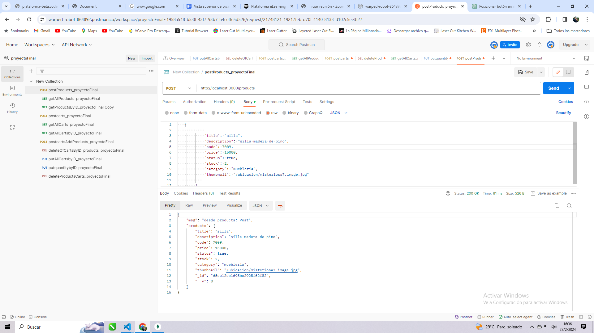

#Proyecto final

Postman
* peticion post

Creacion de productos 

Creacion de producto en base de datos

* Metodo Get con paginado de todos los productos, se establece un limits de 2 con filtrado en muebleria, tanto asc como desc funcionan correctamente

* Obtener producto por id 

* Creacion de carrito

* Peticion get de todos los carritos 

* Obtener producto por id 

* Agregar producto en el carrito 

* Borrar carrito por id

* Actualizar cantidad de productos del carrito

* Actualizar solo la cantidad del producto seleccionado por id

* Borrando todos los productos del carrito

* frontend handlebars visualizacion de base de datos, paginado y posterior guardado de productos en los carritos..enumerados

seleccionando carrito 6 y mascara

* Yendo al apartado carritos y seleccionando el carrito 6

Se obtiene el producto con la cantidad : 1

y volviendo a los productos la mascara va a tener un stock de 31 debido a que a medida q se adjunta a un carrito va decrementando y guardando en la base de datos la cantidad de la misma

* Pasando a la pagina siguiente en un producto donde no hay stock si se hace click va a mostrar un mensaje de "sin stock" 

-a optimizar: incluir el boton de agregar al carrito en un submit parea manipular mejor su correcto funcionamiento-