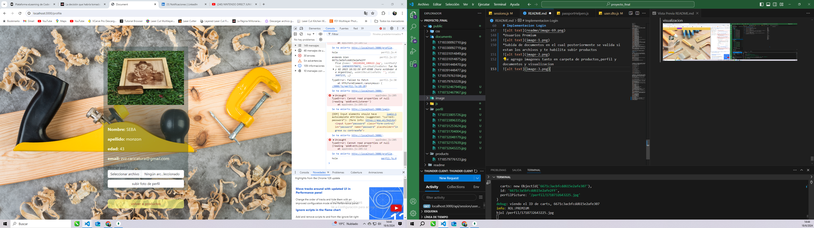

#Proyecto final

Postman
* peticion post

Creacion de productos 

Creacion de producto en base de datos

* Metodo Get con paginado de todos los productos, se establece un limits de 2 con filtrado en muebleria, tanto asc como desc funcionan correctamente

* Obtener producto por id 

* Creacion de carrito

* Peticion get de todos los carritos 

* Obtener producto por id 

* Agregar producto en el carrito 

* Borrar carrito por id

* Actualizar cantidad de productos del carrito

* Actualizar solo la cantidad del producto seleccionado por id

* Borrando todos los productos del carrito

* frontend handlebars visualizacion de base de datos, paginado y posterior guardado de productos en los carritos..enumerados

seleccionando carrito 6 y mascara

* Yendo al apartado carritos y seleccionando el carrito 6

Se obtiene el producto con la cantidad : 1

y volviendo a los productos la mascara va a tener un stock de 31 debido a que a medida q se adjunta a un carrito va decrementando y guardando en la base de datos la cantidad de la misma

* Pasando a la pagina siguiente en un producto donde no hay stock si se hace click va a mostrar un mensaje de "sin stock" 

-a optimizar: incluir el boton de agregar al carrito en un submit parea manipular mejor su correcto funcionamiento-

# Implementacion Login
Entregable 

* Se implemento un registro en el cual se puede seleccionar Admin o user, y solo es permitido un usuario "Admin" con el email : "adminCoder@coder.com" y el password : "adminCod3r123"

* Admin creado 

*login de Admin

* Campo Admin creado solo para ese usuario, 'seba' traido de session

* Otro usuario sin campo Admin

*Apartado de Perfil con datos traidos desde session

se implementa las vistas empleadas en el hands on lab asi como los controladores  , en los mismos se pueden ver el middleware en en cual se encargar de chequear mediante session si esta activo y puede ingresar a la pagina 

* controladores vistas

* Rutas de session 

* controladores de session 

* Middleware para emplear en las rutas

* Guardado en base de datos solo un Admin 

* Se agrego extra ... el campo de admin / user en el registro con mensajes de error o exito asi como en login... a la hora de agregar un producto al carrito el stock va disminuyendo... a la hora de llegar a 0 informa q queda "sin stock" -(Solucionado)
Queda obviada la generacion de ruta privada ya q solo deje visual el campo de Admin.

*intento de compra con dos productos que exceden de stock

*compra realizada con las excepciones de los productos sin stock

*agrego al carro y actualizo pagina para q se intenten agregar la misma cantidad la cual me tiraba error.... e hice un filter para solucionar ese error 

*como se ve en el adjunto haciendo esto supera el stock q hay 

*haciendo como dije un filter en el array solucionado, y mejora visual

*entorno Produccion

*entorno Desarrollo

*ruta testeo logger

*se inserta un link para recuperar password 

*Get para un envio de mail al correo

*el cual mediante un post a una funcion dentro de la carpeta controladores maneja la logica de nodemailer

*para enviar a otro Get y rechazar si el token expira o validarlo si esta dentro de los limites establecidos de dicho token

*manejando errores en el front enviado desde el backend como : "pass mayor a 8 caracteres" , "no repetir contraseña" o en este caso y dentro de esta pagina "envie email nuevamente"(token vencido).

*Documentacion en Swagger

Pruebas de test en el desarrollo

*Usuarios Premium

*Subida de documentos en el cual posteriormente se valida si estan los archivos y te habilita subir productos

*se agrego imagenes tanto en carpeta de productos,perfil y documentos ( visualizacion )

